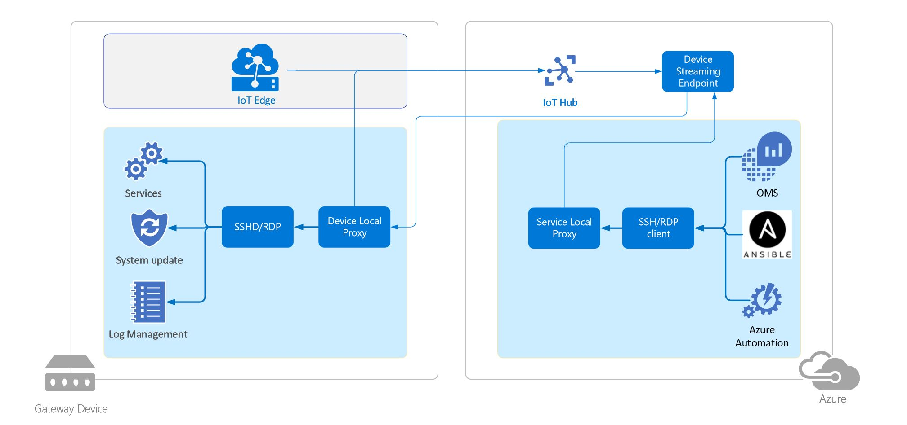

# azure-iot-gateway-updator

This project is a sample solution demonstrating an approach to update the [Azure IoT Edge](https://docs.microsoft.com/en-us/azure/iot-edge/) native runtime components (iotedged and libiothsm) on a remote device via a [Red Hat Ansible](https://www.ansible.com/) playbook running in the cloud. This pattern can be extended to update and manage other pieces of software running on a remote device, such as firmware, services, OS etc. It can also be extended to manage the lifecycle of container images on a remote device.

### Caveats
- This solution has been developed and tested on an x64 Debian based Edge device. The pattern can be extended to other flavors of OS type and hardware architecture.
- This solution has only been tested with a single device. Scaling it out to remote update of devices at scale is a WIP. Thoughts and ideas are welcome!

## Knowledge Pre-requisites

Please familiarize yourself with the following pieces of technology before proceeding as they are the building blocks for this solution:

### Azure IoT Edge

It is important to be familiar with the manual steps for installing, starting and stopping the Azure IoT Edge runtime components on a device. Please follow the documentation to [create](https://docs.microsoft.com/en-us/azure/iot-edge/how-to-register-device-portal) and Azure IoT Edge device and [manage](https://docs.microsoft.com/en-us/azure/iot-edge/how-to-install-iot-edge-linux) the runtime components on the device.

### Azure IoTHub Device Streaming

[This](https://docs.microsoft.com/en-us/azure/iot-hub/iot-hub-device-streams-overview) new feature of Azure IoTHub enables remote access via SSH to a device from a terminal in the cloud. Please familiarize yourself with the [Local Proxy SSH sample](https://docs.microsoft.com/en-us/azure/iot-hub/iot-hub-device-streams-overview#local-proxy-sample-for-ssh-or-rdp) before proceeding. 

### Red Hat Ansible

We will use Ansible roles and playbooks in this repo to automate the update of Azure IoT Edge runtime components. Ansible documentation is clear and easy to understand. Please take some time to watch the [overview video](https://www.ansible.com/resources/videos/quick-start-video?extIdCarryOver=true&sc_cid=701f2000001OH7YAAW) to understand basic Ansible concepts.

## Setup

You will need the following resources provisioned before proceeding:

### Azure IoT Edge device

This can be a VM running in Azure or a Raspberry Pi sitting on your desk. Please follow the [guides](https://docs.microsoft.com/en-us/azure/iot-edge/) in Azure IoT Edge documentation to provision an IoT Edge device.

### Azure IoTHub Device Streaming device-local SSH proxy running on IoT Edge device

If you walked through the Local Proxy SSH sample in the [pre-requisites](#Azure-IoTHub-Device-Streaming) you should already be familiar with running a device-side SSH proxy. For this step of setup, we will need to run the device-side SSH proxy on the Azure IoT Edge device.

Please [create](https://docs.microsoft.com/en-us/azure/iot-hub/quickstart-device-streams-echo-csharp#register-a-device) a regular (non IoT Edge) device in Azure IoT Hub and use its credentials to configure the device-side SSH proxy. If using the C# Device Streaming proxy, you can run the one in this repo as follows:

```
# Linux
cd csharp/build/linux
./build.sh
# Run the device proxy as a background process
run.sh >& /dev/null 2>&1 &

# Windows
cd csharp\build\windows
build.ps1
run_device.ps1
```

The difference between the C# device proxy in this repo vs. the C# device proxy in the official Device Streaming [documentation](https://docs.microsoft.com/en-us/azure/iot-hub/quickstart-device-streams-proxy-csharp#ssh-to-a-device-via-device-streams) is that the former catches exceptions and resumes operation as opposed to terminating like in the latter sample code. Please take a look csharp/Device/Program.cs:49 in this repo to see the loop that restarts the proxy.

### Ansible control VM in Azure

For this step please create a Linux Ubuntu 18.04 VM in Azure. Then follow the [steps](https://docs.ansible.com/ansible/latest/installation_guide/intro_installation.html#latest-releases-via-apt-ubuntu) in the official Ansible documentation to install Ansible on the control VM. Finally, create an RSA key pair for the control machine and install the public key of the pair on the device. This is so that Ansible on the control VM can use passwordless SSH to access the remote device. Guidance on how to do that can be found [here](http://www.linuxproblem.org/art_9.html).

### Ansible pre-requisite on IoT Edge device

Ansible modules/libraries are written in Python and so the devices being managed by the Ansible control VM, need to have Python installed. Please refer to the [documentation](https://docs.ansible.com/ansible/latest/installation_guide/intro_installation.html#managed-node-requirements) for requirements. In the case of this solution, the managed nodes are the IoT Edge devices.

### Azure IoTHub Device Streaming service-local SSH proxy running on Ansible control VM

We will use the Ansible control VM to also run the service-local SSH proxy from the Device Streaming sample listed in [pre-requisites](#Azure-IoTHub-Device-Streaming). Please follow the [instructions](https://docs.microsoft.com/en-us/azure/iot-hub/quickstart-device-streams-proxy-csharp#run-the-service-local-proxy) to run the demo service-local proxy. Please make sure to use the Device Streaming device ID as noted in [an earlier step](#Azure-IoTHub-Device-Streaming-device-local-SSH-proxy-running-on-IoT-Edge-device) and not the IoT Edge device ID when configuring the service-local SSH proxy.

To run the service-local proxy as a background process on the VM run it as follows

```
nohup dotnet run $serviceConnectionString $deviceName $port > logs 2>&1 &
```

## Architecture

In this solution we make use of Device Streaming to set up the underlying transport mechanism between the cloud and the device. And then we use Ansible over the Device Stream to run playbooks on the remote device. In theory, the same pattern can be extended to use other automation frameworks like Azure Automation, OMS, Chef, Puppet etc.



## Running an Azure IoT Edge Ansible playbook on a remote device from the cloud

### 1. Test SSH to the remote device over Device Streams

In order for Ansible to work, the Device Streams service-local proxy and device-local proxy need to be able to communicate with each other. To test this connection, connect over SSH to the service-local proxy on the control VM over the port configured in [a previous section](#Azure-IoTHub-Device-Streaming-service-local-SSH-proxy-running-on-Ansible-control-VM).

```
ssh -i ~/.ssh/id_rsa <user name on device>@localhost -p <port opened on control VM>
```

The port in the above command is the same one used in the [service-local proxy](#Azure-IoTHub-Device-Streaming-service-local-SSH-proxy-running-on-Ansible-control-VM) section. 

### 2. Add the remote device to Ansible inventory

Add an inventory line to the Ansible hosts file. Details on how to do that can be found [here](https://docs.ansible.com/ansible/latest/user_guide/intro_inventory.html).

As an example, adding a remote device might look like the following.

```
[devices]
<any device name or identifier> ansible_port=<port opened on control VM> ansible_host=localhost ansible_user=<user name on device>
```

The port in the above command is the same one used in the [service-local proxy](#Azure-IoTHub-Device-Streaming-service-local-SSH-proxy-running-on-Ansible-control-VM) section. 

### 3. Run an Ansible ping test to the device

After adding the remote device to Ansible's inventory, run a simple ping test from Ansible to the device.

The playbook can have the following lines in it.

```
---
- hosts: devices
  tasks:
  - name: ping the device
    ping:
```

Run the playbook as follows.

```
ansible-playbook <path to ping playbook>
```

Details on creating and running an Ansible playbook can be found [here](https://docs.ansible.com/ansible/latest/network/getting_started/first_playbook.html).

The output of a successful ping test might look the following.

```
PLAY [devices] *************************************************************************

TASK [Gathering Facts] *****************************************************************
ok: [jadsa-auto-linux]

TASK [ping the device] *****************************************************************
ok: [jadsa-auto-linux]

PLAY RECAP *****************************************************************************
jadsa-auto-linux           : ok=2    changed=0    unreachable=0    failed=0

```

### 4. Experimental approach still under review: Run an Ansible playbook to update Azure IoT Edge runtime components on a remote device

Clone dsajanice's fork of Ansible on the control VM to get experimental Azure IoT Edge Ansible module.

```
git clone https://github.com/dsajanice/ansible.git
```

Install the experimental Azure IoT Edge module locally on the control VM. Details on how to do that are [here](https://docs.ansible.com/ansible/latest/dev_guide/developing_locally.html#adding-a-module-locally). This is what the module install step might look like.

```
cp lib/ansible/modules/cloud/azure/azure_rm_iotedge.py ~/.ansible/plugins/modules/azure_rm_iotedge.py
```

After installing the experimental Azure IoT Edge Ansible module locally on the control VM, the [playbook](ansible/ubuntu/azure-iot-edge-update.yml) in this repo can be run to update the Azure IoT Edge runtime components on the remote device.

The playbook has a token, **#{azure_iot_edge_desired_version}#-1**, that a user can replace to the desired version of Azure IoT Edge on the device. For example:

```
- name: Update Azure IoT Edge runtime components
    azure_rm_iotedge:
      update_runtime:
        version: "1.0.6.1-1"
    when: version_info.version != "1.0.6.1"
    register: update
    become: yes
    become_method: sudo
```

The playbook will read the current version on the device, update the runtime components if the current version doesn't match the user-provided desired version, delete the Edge Hub and Edge Agent containers and container images and restart the Azure IoT Edge runtime components. 

### 5. Create an Azure DevOps release pipeline to kick off the Ansible playbook on the control VM

Create an Azure Dev Ops Ansible task that points at the control VM, which already has a preconfigured inventory list, to run the [playbook](ansible/ubuntu/azure-iot-edge-update.yml) in this repo. To get access to an example repo with a sample pipeline, email jadsa@microsoft.com and request access.

To set the desired version in the Ansible playbook, use the 'Replace Tokens' Azure Dev Ops task to replace **azure_iot_edge_desired_version** with the desired version.
